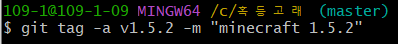
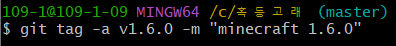
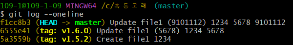
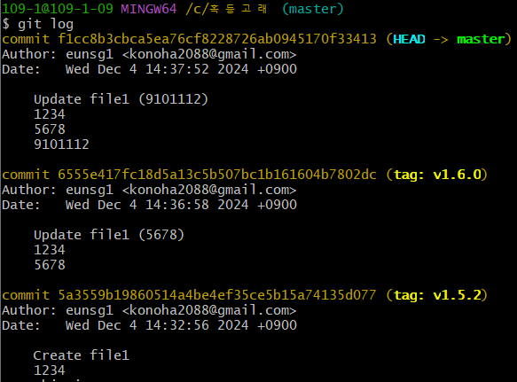

## 버전 표시 형식

마인크래프트 1.5.2
[이름] [메이저].[마이너].[패치]

메이저
- 첫 자리가 0이면 초기 개발 중(메이저 아님).
- 정식 버전은 1부터(메이저 맞음).

마이너
- 메이저 버전에서 기능을 추가하거나 변경 사항이 있을 때 바꿈.

패치
- 버그 수정 등 미미한 변화.

## 태그

#### 주석 태그 (Annotated Tag)
- [누가, 언제, 태그 메시지 등의 정보]
- 태그 버전 이름 중복 불가능.

[버전] = v1.5.2
git tag -a [버전] -m '[메시지]': 작성한 사람의 이메일, 날짜, 메시지 등의 정보 포함.

git config --global init.defualtBranch 'code --wait': ↓
git tag -a [버전]: 기본 설정된 편집기로 메시지 편집.   ←

git tag [버전] HEAD~[숫자]:        ↓
git tag -a [버전] [커밋 ID]: 특정 커밋에 태그를 붙임.

git tag: 예전 태그부터 최신 태그까지 순차적으로 표시.
git log: 최신 커밋부터 순차적으로 표시.
git show [버전]: [버전]의 주석 태그 표시.

git tag -d [버전]: [버전]의 주석 태그 삭제.

커밋 기록(1234 - 5678 - 9101112)

1234 커밋
제목: Create file1 / 내용: 1234

태그 작성

5768 커밋
제목: Update file1 (5678) / 내용: 1234 5678

태그 작성

9101112 커밋
제목: Update file1 (9101112) / 내용: 1234 5678 9101112

결과

