스태시 실습

file1 생성 후 커밋

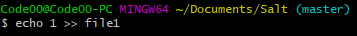

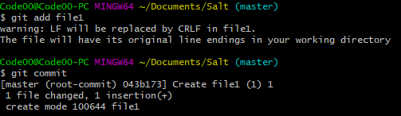

file2 생성 후 add, file3 생성.

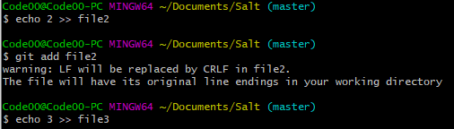

Stash

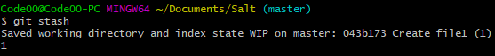

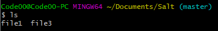

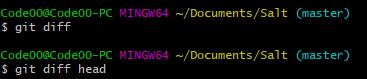

file4 생성 후 add, file 5 생성, Stash

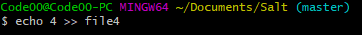

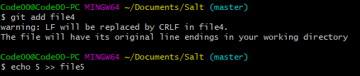

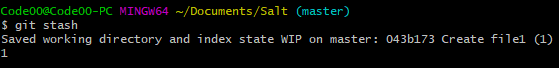

리스트

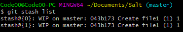

스태시{1} 복원

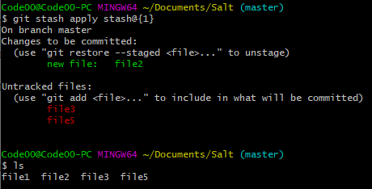

다시 Stash

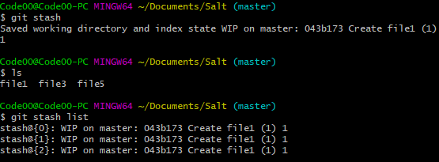

스태시 불러오기만 하면 안 사라짐.

차이점 보기

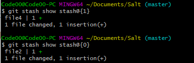

Untracked 파일도 Stash

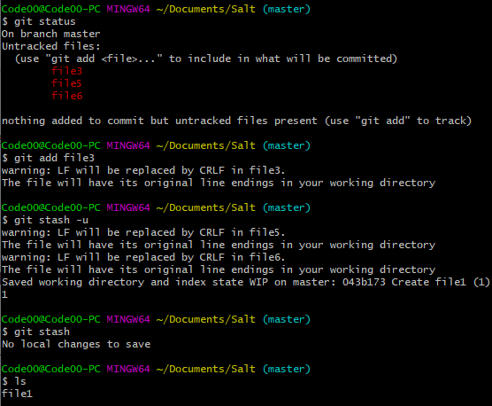

file7 생성 후 Untracked 삭제

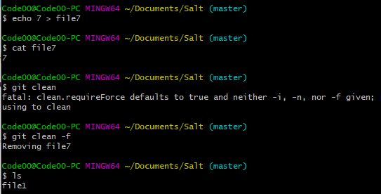

Stash 삭제

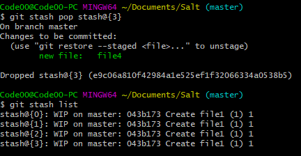

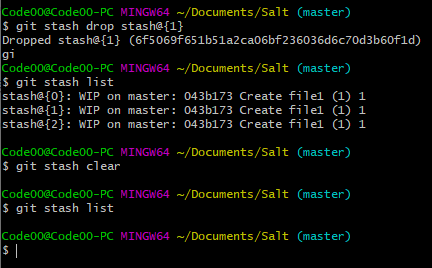

스태시 삭제되면 번호 밀림.
